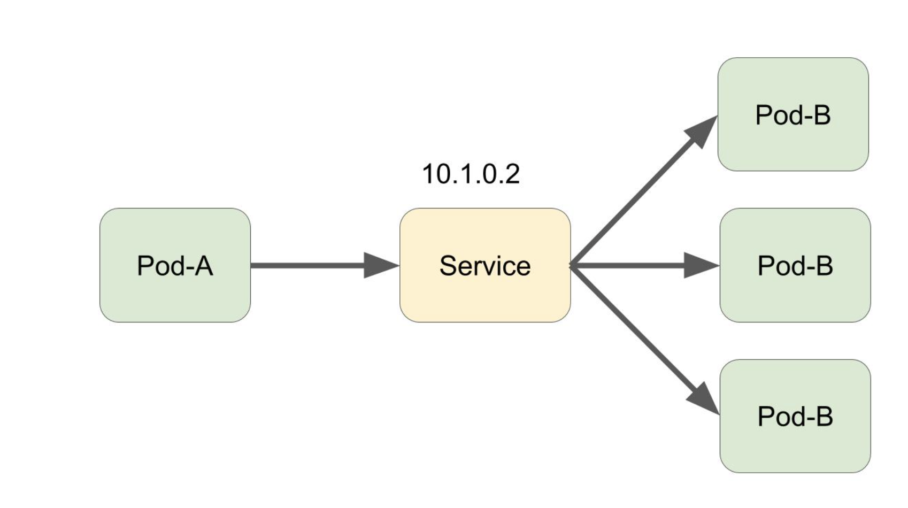
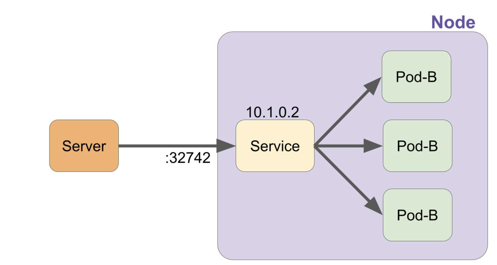
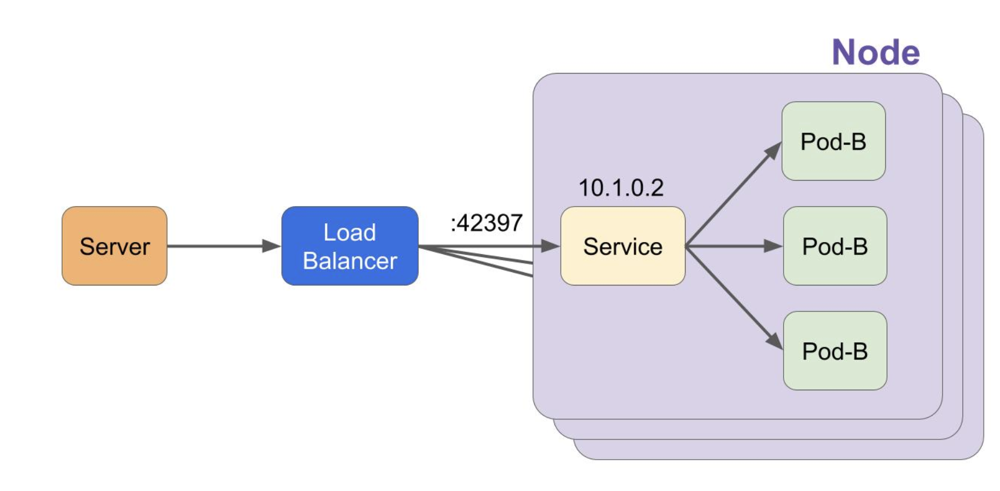
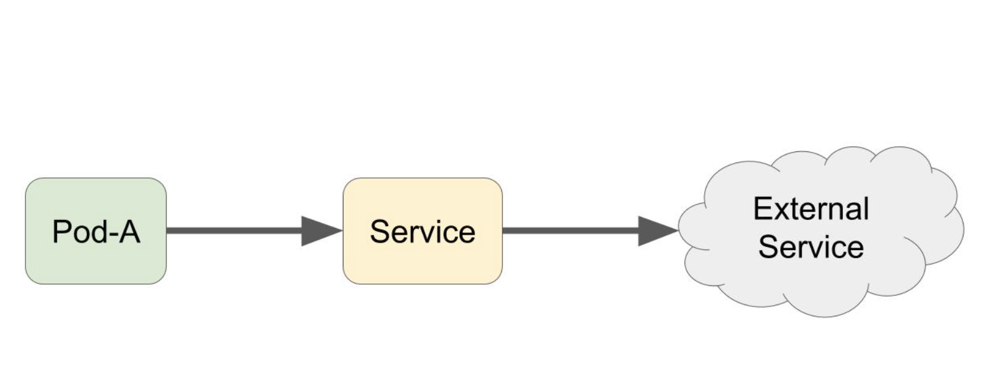

### serviceとは

- Podへの接続を解決してくれる
- 端的にはSelectorで選択したPodをUpstreamとしたLB
- Serviceには4つの種類
  - ClusterIP
  - NodePort
  - LoadBalancer
  - ExternalName
```
ports:
- name: http
  port: 80
  targetPort: 8080
```
- name : ポートの名前を指定する。DNS_LABEL に従っている必要があり、Service定義内でユニークである必要がある。また、1つ以上のポートを指定する場合 name が指定必須になる。
- port : ServiceでExposeするポートを指定する。
- targetPort : Serviceで転送する先のポートを指定する。またはPod内で定義されているNamedPortを指定する。指定されなかった場合、 port で指定されたポートを利用する。

### ClusterIP
- Kubernetes内での通信で利用する。クラスタ内でIPアドレスが払い出され、それを利用してPod間で通信を行う
- clusterIP にIPアドレスを指定することで指定されたIPアドレスでServiceが作成される


### NodePort
- KubernetesのNodeのランダムなポートを使用して外部のサーバーからの疎通性を取ってくれる。 その後はClusterIPのServiceと同様


### LoadBalance
- NodePortのServiceを作成した上で、さらに外部のLoadBalanerを作成し、LoadBalancerのUpstreamとしてNodePortで疎通性を取っているポートへ転送するよう設定してくれる


### ExternalName
- ExternalNameは外部のサービスに対してのエイリアス(別名)を作成できる

