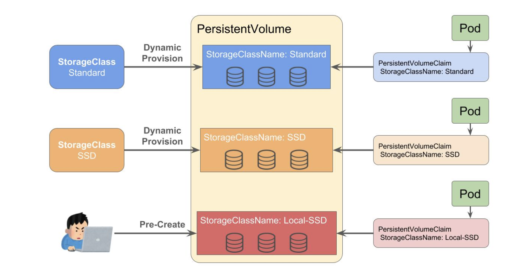

# Storageについて

## Volumes
- コンテナのデータは一時的なもので、Pod/コンテナが削除されればデータが消えてしまう。Kubernetesが再起動させてくれば場合でもコンテナのデータは消えてしまう。
- Volumeはデータの永続化をしてくれる。 永続化したいデータは指定したVolumeに保存することで削除やクラッシュした際でもデータが残る。
- また、Volumeは別の目的でも使用される。それはPod内でのコンテナ間のデータ共有

Volumeにはいくつかの種類がある。
- emptyDir
- hostPath
- configMap
- secret
- gcePersistentDisk
- awsElasticBlockStore
- csi
- downwardAPI
- nfs

### hostPath
```
apiVersion: v1
kind: Pod
metadata:
  name: test-pd
spec:
  containers:
  - image: registry.k8s.io/test-webserver
    name: test-container
    volumeMounts:
    - mountPath: /test-pd
      name: test-volume
  volumes:
  - name: test-volume
    hostPath:
      path: /data
      type: Directory
```



## PersistentVolume
永続化ボリュームそれ自体についてのオブジェクト。StorageClassを元に動的に作成されたものや、Kubernetes管理者によって追加されたボリュームも含まれる。

## StorageClass
ストレージの種類を示すオブジェクト。例えば通常・高可用性・高スループットなど。また、プロビジョニングという永続化ボリュームを動的に作成する設定もこのStorageClassに行う

## PersistentVolumeClaim
永続化ボリュームの利用請求をするオブジェクト。永続化ボリュームを使用する際は、このPersistentVolumeClaimリソースを作成する。その後、クレームに従ったものが自動的にプロビジョニングされるか、Kubernetesの管理者がクレームに従ったものを作成するかをして永続化ボリュームが払い出される。


## PV / PVCを使ってPodにマウントする
PV作成
```
apiVersion: v1
kind: PersistentVolume
metadata:
  name: pv0001
spec:
  capacity:
    storage: 1Gi
  volumeMode: Filesystem
  accessModes:
    - ReadWriteOnce
  persistentVolumeReclaimPolicy: Delete
  storageClassName: slow
  hostPath:
    path: /data/pv0001
    type: DirectoryOrCreate
```
今回はPVにhostPathを使用している。使用方法はPodでVolumeを使用した際と同様

PVC作成
```
apiVersion: v1
kind: PersistentVolumeClaim
metadata:
  name: pv-slow-claim
spec:
  accessModes:
    - ReadWriteOnce
  volumeMode: Filesystem
  resources:
    requests:
      storage: 1Gi
  storageClassName: slow
```

このPVCを元にPodを作成し、マウントする

POD作成
```
apiVersion: v1
kind: Pod
metadata:
  name: pvc-slow-test
spec:
  containers:
  - image: alpine
    name: alpine
    command: ["tail", "-f", "/dev/null"]
    volumeMounts:
    - name: claim-volume
      mountPath: /data
  volumes:
  - name: claim-volume
    persistentVolumeClaim:
      claimName: pv-slow-claim
  terminationGracePeriodSeconds: 0
```
